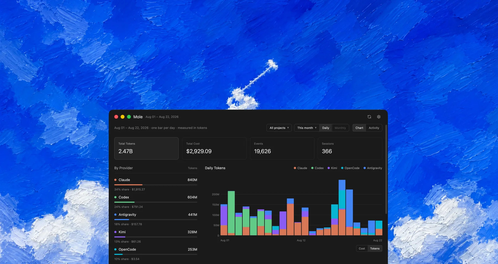

<p align="center">
  
</p>

<p align="center">
  
  
  
</p>

# Mole

Mole is a native desktop dashboard for the token usage and estimated cost of your AI
coding agents. It reads the transcripts and local databases those tools already write
to your machine, aggregates them, and renders the result as a chart with per-provider
and per-model breakdowns.

Everything happens locally: no account, no API keys, and no telemetry. Your transcripts
are opened read-only and never leave the machine. The one request Mole makes is the
update check — a public GitHub Releases lookup you can turn off in Settings.

## Features

- **Five providers in one view** — Claude Code, Codex, Kimi Code, OpenCode, and Antigravity,
  each with its own color in a stacked bar chart.
- **Cost or tokens** — one switch re-ranks the whole page. A cheap model can dominate the
  token ranking while barely showing in the cost one; both numbers stay on screen.
- **Time ranges** — last 7 / 30 / 90 days, this month, last month. Daily or monthly bars,
  with monthly offered only when the range actually spans more than one calendar month.
- **Projects** — filter the whole page to the directory the work ran in, and see which
  agents you use on each project and what they cost there. The menu ranks projects by the
  selected metric, so the one running up the bill is the one at the top.
- **Headline stats** — total cost, total tokens, event count, session count.
- **Token breakdown** — processed tokens with a per-active-day average, cached input,
  fresh input, cache writes, output including reasoning, and estimated cache savings.
- **Breakdowns** — provider share bars and a configurable top-N model list, both ranked by
  the selected metric.
- **Chart tooltips** — hover a bar for its per-provider split.
- **Deduplication** — Claude repeats a message's usage on every content block and Codex
  re-emits identical token counts at stream boundaries; both are collapsed so totals are
  not inflated.
- **Settings** — theme (system / light / dark), default range, scan-on-launch, automatic
  rescan interval, model row count, and a per-provider on/off switch that narrows what gets
  scanned.
- **Update checks** — Mole asks GitHub whether a newer release exists, on the Stable or
  Beta channel. Stable never offers a pre-release; Beta offers whichever build is newest.
  Off in one click, and it downloads nothing by itself.
- **Native chrome** — custom toolbar, macOS menu bar, and keyboard shortcuts.

## Data sources

Mole never asks where your data is; each provider is read from its standard location.

| Provider | Location | Format |
| --- | --- | --- |
| Claude Code | `~/.claude/projects` | `.jsonl` transcripts |
| Codex | `~/.codex/sessions` | `.jsonl` rollouts |
| Kimi Code | `~/.kimi-code/sessions` | `wire.jsonl` session logs |
| OpenCode | `~/.local/share/opencode/opencode.db` | SQLite |
| Antigravity | `~/.gemini/antigravity/conversations` | SQLite + protobuf blobs |

Missing directories are skipped, so only the agents you actually use show up.

Each provider also records the directory a session ran in, which is what the project filter
groups by: Claude and Codex write it on their transcripts, Kimi keeps it in the session's
`state.json`, OpenCode on the session row, and Antigravity in the conversation's trajectory
metadata. Usage from a record that names no directory is grouped as "Unknown project" rather
than dropped from the totals.

## How cost is computed

When a provider records what it charged — Claude's `costUSD`, OpenCode's `cost` — Mole
uses that number. Otherwise it prices the event from a built-in table covering Anthropic,
OpenAI, Kimi, Gemini, and the models OpenCode hosts, with separate rates for fresh input,
cached input, cache writes, and output. Lookups fall back to a prefix match, so dated model
variants resolve to their family rate. A model with no known rate contributes tokens but
no cost.

Cost figures are estimates for your own tracking, not a bill.

## Tech stack

- **Rust** (2024 edition)
- **[GPUI](https://github.com/zed-industries/zed)** — the GPU-accelerated UI framework
  behind Zed; every element, chart, and dialog here is drawn with it
- **rusqlite** (bundled SQLite) for the OpenCode and Antigravity stores
- **serde / serde_json** for transcript and settings parsing
- **chrono** for date bucketing, **dirs** for platform paths

The Antigravity reader includes a small hand-written protobuf wire-format decoder — no
schema or codegen dependency.

## Requirements

- Rust 1.97 or newer — GPUI's upstream pins that toolchain; built and tested with 1.97.1
- macOS: Xcode Command Line Tools
- Linux: a Wayland or X11 session plus the usual GPUI build dependencies

GPUI is pulled straight from the Zed repository, so the first build clones a large tree
and takes a while. Later builds are incremental.

## Install

Download the latest DMG from [Releases](https://github.com/duongductrong/mole/releases),
drag Mole to Applications, and open it. Beta builds are published as pre-releases; a
stable install is never offered one unless you switch channel in Settings.

From source:

```bash
git clone https://github.com/duongductrong/mole.git
cd mole
cargo run --release
```

To install the binary onto your `PATH`:

```bash
cargo install --path .
```

To build the same `.app` and DMG the release workflow does:

```bash
scripts/bundle-macos.sh          # unsigned, into dist/
```

Releasing is documented in [docs/RELEASING.md](docs/RELEASING.md).

## Usage

Mole scans on launch by default and shows a skeleton while it works. Pick a range from the
pill in the filter bar, narrow to one project from the pill beside it, switch between cost
and tokens on the chart, and hover a bar for its breakdown. Turning a provider off in
Settings removes it from the next scan entirely.

Only the range costs a scan, and rarely even that. The project filter, the Daily/Monthly
switch and the cost/tokens switch are all views over the snapshot already in hand, and each
range you look at is cached for the rest of the session — switching back is a memory swap
rather than another read of every transcript. The disk is only touched when you ask (`⌘R`
or the refresh button), when an automatic scan comes due, or on a range's first visit.

An open window also rescans on its own; Settings → Scanning offers 5 or 15 minutes, an
hour, two hours, or Off. Automatic scans leave the dashboard on screen rather than showing
the skeleton, and the interval is counted from the last scan, so pressing `⌘R` postpones
the next one instead of being followed by a second. The refresh button works on every
setting, `Off` included.

| Shortcut | Action |
| --- | --- |
| `⌘R` / `Ctrl+R` | Rescan transcripts |
| `⌘,` / `Ctrl+,` | Open settings |
| `⌘W` / `Ctrl+W` | Close window |
| `⌘M` / `Ctrl+M` | Minimize |
| `⌃⌘F` (macOS) / `F11` | Toggle full screen |
| `Esc` | Dismiss the settings dialog |
| `⌘Q` / `Ctrl+Q` | Quit |

Settings are stored as JSON at `~/Library/Application Support/mole/settings.json` on macOS
and `~/.config/mole/settings.json` on Linux. The file is optional and hand-editable;
unknown or corrupt values fall back to the defaults.

### Updates

Settings → Updates holds the whole feature: a switch for the check on launch, the channel
to follow, and a **Check now** button that works even with the launch check off. When a
newer build exists the toolbar grows an *Update to …* button; both it and **Download**
open the release page — Mole never installs anything itself.

A build's own version decides which channel it starts on, so installing a beta opts you
into betas and nothing moves a stable install onto one silently. Semantic versions are
compared properly, `0.2.0-beta.10` included, and a beta install is offered `0.2.0` the
moment it ships. The macOS menu has **Check for Updates…** under the app menu.

## Development

```bash
cargo test     # bucketing, pricing, formatting, settings, scroll math, update rules
cargo check
cargo run      # debug build

cargo test -- --ignored --nocapture   # the update check against the real GitHub API
```

`cargo run` starts the bare binary, which macOS shows with the generic
executable icon in the Dock — an app icon only comes from a bundle. Run the
bundled app instead when you want to see it:

```bash
scripts/bundle-macos.sh && open dist/Mole.app
```

Layout:

```
src/
  core/       scanning, parsing, pricing, aggregation — no UI types
    scanner.rs    per-provider parsers, dedup, snapshot building
    pricing.rs    built-in rate table and cost math
    types.rs      snapshots, buckets, time windows, metrics
    update.rs     GitHub release lookup, channels, version comparison
  ui/         GPUI views and components
    app_view.rs   root view, scan orchestration, dialog focus
    dashboard.rs  the page: filters, stats, chart, breakdowns
    settings_dialog/  the settings sheet: sidebar, and one pane module per
                      category under panes/
  settings.rs persisted preferences, published as a GPUI global
  theme.rs    light/dark palettes and provider colors
  keymap.rs   actions, key bindings, macOS menu bar
scripts/      bundle-macos.sh — .app, DMG, signing, notarization
.github/
  scripts/    release-notes.sh — notes from the commits since the last release
  workflows/  ci.yml (tests, unsigned build) and release.yml (manual, beta/stable)
```

`core` takes its inputs as plain arguments and knows nothing about settings or rendering,
which is what keeps a new preference to one edit in `settings.rs` and one at the call site.

## License

[MIT](LICENSE)
